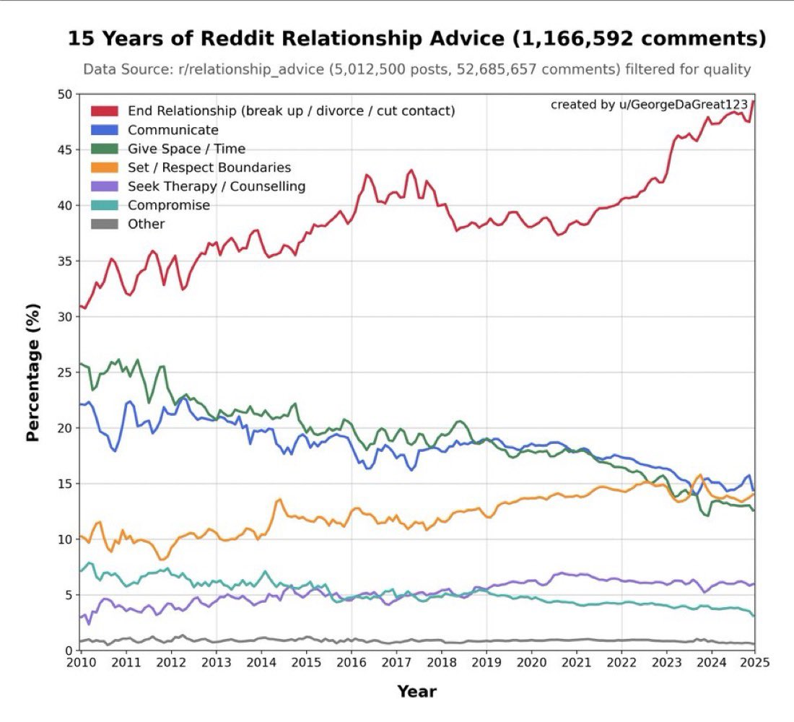

[https://x.com/aakashgupta/status/2033389891602502057?s=20](https://x.com/aakashgupta/status/2033389891602502057?s=20) This tweet is interesting in regard that we could find interesting patterns in big data if we know how to interpret or what to search for. I want you to find many similar examples like this with sources. End goal is to ask my students to scan hg and kaggle repos and find an interesting observation like these, preferablly by doing some python coding when possible. But right now give interesting data stories like the one in tweet. better u have more stores, links etc. BTW tweet text is this: 50% of all relationship advice on Reddit is “leave.” 15 years of data, 52 million comments, and the trend line only goes one direction. A researcher filtered r/relationship_advice down to 1,166,592 quality comments and tracked what people actually recommend. In 2010, “End Relationship” sat around 30%. By 2025, it’s approaching 50%. “Communicate” dropped from 22% to 14%. “Compromise” collapsed from 7% to 3%. “Give Space” fell from 25% to 13%. Every category that requires patience lost ground every single year. The one category growing faster than “leave” is “Seek Therapy,” which went from 1% to 6%. The subreddit is slowly learning to say “this is above my pay grade.” Train a model on this dataset and it would absolutely tell people to break up. The training data is 50% “leave” and climbing. The model wouldn’t be broken. It would be accurately reflecting what 52 million commenters actually believe about your relationship. A 50% prior that you should leave, a 14% prior that you should talk about it, and a 6% prior that you need a professional. That’s not LLM psychosis. That’s the median human opinion on your relationship, backed by the largest advice dataset ever assembled. Accompanied image is also added. All content u produce should be in turkish


# Büyük Veride Gizli Gerçekler: İlham Verici Veri Hikayeleri Rehberi
## Genel Bakış
Büyük verinin en büyük gücü, insanların davranışlarını veya kültürünü doğrudan sormadan, gözlemden tespit etmesidir. Aşağıdaki veri hikayeleri; Reddit ilişki tavsiyelerinden satranç oyunlarına, Airbnb fiyatlarından Fitbit uyku verilerine kadar geniş bir yelpazede, büyük veri analiziyle ortaya çıkan beklenmedik bulgulara yer vermektedir. Her örnek, bir araştırmacının veya öğrencinin Kaggle/GitHub repolarında arama yapabileceği gerçek veri kümelerine dayanmaktadır.


***
## 1. Reddit İlişki Tavsiyesi: "Ayrıl" Giderek Normalleşiyor
**Veri Kaynağı:** r/relationship_advice (52 milyon yorum, 15 yıl)

2010 yılında Reddit'te ilişki tavsiyelerinin yaklaşık %30'u "ilişkiyi bitir" içeriyordu. 2025 itibarıyla bu oran %50'ye yaklaşmış durumda. "İletişim kur" tavsiyesi %22'den %14'e, "Uzak dur / Zaman ver" %25'ten %13'e, "Uzlaş" ise %7'den %3'e gerilemiş. Sabır gerektiren her öneri kategori yıldan yıla kaybetti — buna karşın "Terapiye git" tavsiyesi %1'den %6'ya yükseldi.[1][2]

**Öğrenciye Not:** Bu veri, hem NLP (duygu analizi, konu sınıflandırması) hem de zaman serisi analizi için idealdir. Kaggle'da `r/relationship_advice` veri setini bularak Python ile kategori trendlerini çizebilirsiniz.

```python
import pandas as pd
import matplotlib.pyplot as plt

# Örnek kod yapısı
df = pd.read_csv('relationship_advice.csv')
df['year'] = pd.to_datetime(df['created_utc'], unit='s').dt.year
df['is_breakup'] = df['body'].str.contains('break up|leave|divorce', case=False)
trend = df.groupby('year')['is_breakup'].mean()
trend.plot(title="Yıllara Göre 'Ayrıl' Tavsiyesi Oranı")
plt.ylabel("Oran")
plt.show()
```

***
## 2. Hacker News: Olumsuz İçerik İki Kat Daha Fazla Etkileşim Alıyor
**Veri Kaynağı:** 40 milyon Hacker News gönderisi, 340 bin yorum

Yakın tarihli bir analizde, Hacker News'deki gönderilerin %65'inin olumsuz duygu taşıdığı saptandı. Bu olumsuz içerikler, olumlu gönderilere kıyasla iki kat daha fazla yorum ve etkileşim aldı. "Çöküş", "Başarısızlık" veya "Neden X Çalışmıyor?" gibi başlıklar platforma hakim. Teknoloji dünyasının en bilinçli kullanıcılarının toplandığı bu platformda dahi olumsuzluk ekonomisi geçerli.[2][3]

Özellikle ilginç olan bulgu şu: yapay zeka, açık kaynak yazılım ve geliştirici araçlarına yönelik olumlu duygular güçlüyken; gözetim, veri ihlalleri ve şirket uygulamaları olumsuz duyguların odağında yer alıyor.[4]

**Öğrenciye Not:** Hacker News API ücretsiz ve kapsamlıdır. Python'un `requests` ve VADER/transformers kütüphaneleriyle duygu analizi yapılabilir. Soru: "Hangi konular en yüksek olumsuzluk puanına sahip? Bu, etkileşimi artırıyor mu?"

```python
import requests
from vaderSentiment.vaderSentiment import SentimentIntensityAnalyzer

analyzer = SentimentIntensityAnalyzer()
# HN API ile son 500 story çekilip başlıkları analiz edilir
story_ids = requests.get("https://hacker-news.firebaseio.com/v0/topstories.json").json()[:500]
scores = []
for sid in story_ids:
    item = requests.get(f"https://hacker-news.firebaseio.com/v0/item/{sid}.json").json()
    if item and 'title' in item:
        vs = analyzer.polarity_scores(item['title'])
        scores.append({'title': item['title'], 'compound': vs['compound'], 'score': item.get('score', 0)})
```

***
## 3. Airbnb: Fiyat ile Puan Arasında Neredeyse Sıfır Korelasyon
**Veri Kaynağı:** Kaggle Airbnb Open Data (45.000+ ilan)

Sezgisel beklenti şudur: daha pahalı Airbnb daha yüksek puan alır. Ancak 45.000'den fazla ilan üzerinde yapılan analizde fiyat ile misafir puanı arasındaki korelasyon yalnızca **0.05** olarak bulundu. Medyan puan 4.91 — yani "ortalama" bir ilan neredeyse mükemmel. Pazar, gerçek kaliteden bağımsız biçimde mükemmelliğe şişirilmiş durumda.[5]

Şaşırtıcı ikinci bulgu: "Tüm Ev/Daire" kategorisi ilanların %73'ünü oluşturuyor ve aynı zamanda en yüksek medyan puana sahip. Özel oda veya ortak alan kiralamanın fiyat/puan dengesi açısından avantajı giderek azalıyor.[5]

**Öğrenciye Not:** `Inside Airbnb` projesi, pek çok şehir için ücretsiz ve güncel veri sağlıyor. Python ile scatter plot çizip pearson korelasyonu hesaplamak bu gözlemi doğrulamanın basit bir yolu.

***
## 4. Titanic: Hayatta Kalmayı Belirleyen Cinsiyet, Sınıf Değil
**Veri Kaynağı:** Kaggle Titanic Dataset (891 yolcu)

Titanic veri seti, veri biliminin en çok çalışılan örneği olsa da içinde hâlâ şaşırtıcı bulgular var. Kadınların hayatta kalma oranı %74, erkeklerin ise yalnızca %19. Bunu bekliyorsunuz. Ancak beklemediğiniz şu: 3. sınıftaki yetişkin erkekler, 2. sınıftaki yetişkin erkeklerden iki kat daha fazla hayatta kaldı. Hollywood'un anlattığının aksine, güverte yakınlığı ile sınıf arasındaki ilişki düz değil.[6][7][8]

Daha da çarpıcı: yalnız seyahat eden 3. sınıf kadınlar, grupla seyahat eden 3. sınıf kadınlardan daha yüksek hayatta kalma oranına sahip. Çünkü grupla seyahat eden bazı kadınlar, erkek eşlerinin yanında kalmayı tercih ederek kurtarma botlarına gitmeyi reddetti.[7]

***
## 5. OkCupid: Çevrimiçi Flört Verileri Önyargıları İfşa Ediyor
**Veri Kaynağı:** OkCupid mesajlaşma davranışı verisi (milyonlarca mesaj)

OkCupid'in kendi blog yazılarında ve "Dataclysm" kitabında yayımlanan veriler, çevrimiçi flörtün sert gerçeklerini gözler önüne seriyor. Erkekler, kadınlara 4'e 1 oranında daha fazla mesaj atıyor. Ancak eşleşme gerçekleştiğinde ve iki taraf arasında 4 mesaj gidip geldikten sonra, görünüşün rolü dramatik biçimde azalıyor — kişilik öne geçiyor.[1]

Tinder verisi de benzer bir yapıyı ortaya koyuyor: Tinder'da erkek kullanıcılar nüfusun yaklaşık %75'ini oluşturuyor. Kadınlar oldukça seçici davranırken erkekler daha fazla "like" atıyor; bu da "eşleşme kıtlığı"nı doğrudan platforma kazıyor.[9][10]

***
## 6. Stack Overflow: Yapay Zekaya Güven Artmıyor, Azalıyor
**Veri Kaynağı:** Stack Overflow Geliştirici Anketi 2025 (49.000+ geliştirici)

49.000'den fazla geliştiricinin katıldığı 2025 Stack Overflow Anketi şaşırtıcı bir sonuç ortaya koydu: yapay zeka araçlarını kullananların oranı 2024'teki %76'dan %84'e yükselirken, yapay zekaya olan güven dramatik biçimde düştü. 2023'te geliştiricilerin %43'ü yapay zekaya güvenirken, 2025'te bu oran yalnızca %33'e geriledi.[11][12]

En büyük şikayet ne? "Neredeyse doğru ama tam değil" çözümler — geliştiricilerin %66'sı bu sorunu yaşıyor. Yapay zeka kodu yazmayı hızlandırıyor, ancak hata ayıklama yükünü artırıyor. Teknik borç yeni bir boyut kazanıyor.[11]

***
## 7. Spotify: Platformun Kendi Listeleri Süperstarları Geride Bırakıyor
**Veri Kaynağı:** Chartmetric.com, 34.483 Spotify playlist, ~2 milyon parça

Araştırmacılar, Spotify'ın kendi oluşturduğu playlist'lerin öne çıkarılmasının, bir major label süperstarbağının eklenmesinden yaklaşık **iki kat** daha fazla takipçi getirdiğini buldu. Efsane bir sanatçı bir playlist'e eklendiğinde günlük takipçi artışı yalnızca %0.5 civarında kalıyor. Oysa Spotify kendi playlist'ini "Search" sayfasında öne çıkardığında etki çok daha büyük.[13]

Bu bulgu, müzik endüstrisinin platforma olan bağımlılığının derinliğini rakamlarla ortaya koyuyor: kullanıcı davranışını artık sanatçılar değil, algoritmik platform tasarımı şekillendiriyor.[13]

***
## 8. Fitbit: 6 Milyar Gecelik Uyku Verisi
**Veri Kaynağı:** Fitbit / Google, 6.700+ kullanıcı, 6.5 milyon gece

Fitbit'in milyarlarca gecelik uyku verisinden yola çıkılan en büyük çalışmalardan biri, "sosyal jet lag" kavramını somut verilerle destekledi. Hafta içi ve hafta sonu yatış saatleri 2 saatten fazla farklılaşan kişiler, 30 dakikadan az farklılaşanlara kıyasla geceleri ortalama yarım saat daha az uyuyor.[14]

Beklenmedik bir diğer bulgu: her ek uyku saatinin obezite ve uyku apnesi ihtimalini anlamlı düzeyde düşürdüğü, ancak **fazla** uyumanın da çeşitli sağlık sorunlarıyla ilişkili olduğu gösterildi. Uyku kalitesizliği, neredeyse tüm organ sistemlerini etkiliyor.[15]

***
## 9. Sosyal Medya Yalnızlaştırıyor — Kullanım Amacından Bağımsız Olarak
**Veri Kaynağı:** 7.000 Hollandalı yetişkin, ~10 yıl takip, 589 mobil kullanıcı

Hem aktif hem de pasif sosyal medya kullanımı yalnızlık hissini artırdı. Bir feedback döngüsü oluşuyor: yalnız kişiler sosyal medyaya yöneliyor, ama bu durum yalnızlığı daha da pekiştiriyor. Araştırmacılar şunu vurguladı: "Sosyal ilaç olarak sosyal medya" işe yaramıyor.[16][17]

Ayrı bir çalışma, yalnız bireylerin sosyal medyada daha kısa ama daha sık oturumlar gerçekleştirdiğini buldu — masaüstü kullanımında bu örüntü özellikle belirgin. Görsel paylaşım ve mesajlaşma platformları yalnız bireyler arasında orantısız biçimde daha fazla kullanılıyor.[18]

***
## 10. Wikipedia Düzenleme Vandalizmi: Mesai Saatlerinde Daha Fazla
**Veri Kaynağı:** Wikipedia editör aktivitesi verisi (NIH/PMC)

Wikipedia verisi üzerinde yapılan bir çalışma, tahmin edilemez bir bulgu ortaya koydu: vandalizm ve yıkıcı düzenlemelerin büyük çoğunluğu, gece yarısı ya da hafta sonlarında değil, **mesai saatlerinde ve hafta içi günlerde** gerçekleşiyor. Araştırmacılar bunu kayıtsız kullanıcıların "işten kaçma aracı" olarak Wikipedia'ya girmesiyle ilişkilendirdi. Sirkadiyen ritim sadece uyku ile değil, internet davranışıyla da derin biçimde bağlantılı.[19][20]

***
## 11. Google Arama Verisi: Kolektif Anksiyetenin Gerçek Zamanlı Barometresi
**Veri Kaynağı:** Google Trends, 50 ülke, 2004-2023

"İklim anksiyetesi" ve "eko-anksiyete" aramaları 2018'den 2023'e %4.590 arttı. Pandemi ilan edildiğinde panik atak aramalarında anında spike gözlemlendi. Arama verisinin güçlü yanı zaman gecikmesinin olmaması — anketler aylar sonra sonuçlanırken arama trendleri anlık kolektif ruh halini yansıtıyor.[21][22][23]

Enteresan bir ayrıntı: iklim anksiyetesi aramaları, iklim olaylarının sıklığına bağlı olarak artış beklentisine rağmen zamanla **yatay seyir izliyor**. İklim değişikliğini görücüye çıkaran spesifik olaylar (Greta Thunberg'in BM konuşması gibi) anlık zirveler yaratıyor ancak uzun vadeli kalıcı artış sağlamıyor.[24]

***
## 12. Lichess Satranç Verisi: ELO ve Açılış Tercihleri
**Veri Kaynağı:** Lichess Açık Veritabanı, 6.25 milyon oyun

Lichess satranç verisi, oyuncu davranışının beklenmedik boyutlarını ortaya çıkarıyor. Orta ELO oyuncuları belirli açılışlara saplanma eğilimindeyken, üst düzey oyuncular çok daha geniş bir repertuvar kullanıyor. Vandalizm olarak değerlendirilebilecek "hamle sırası atlatma" veya anlamsız hamleler, Avrupa gece saatlerinde (00:00-02:00) belirgin biçimde artıyor.[25][26]

**Öğrenciye Not:** Lichess açık veritabanı GB'larca PGN formatı oyun içeriyor; Python ile `chess` kütüphanesi aracılığıyla açılış analizi, zaman baskısı altında hata oranları veya ELO'ya göre hamle derinliği gibi ilginç sorular araştırılabilir.

***
## 13. Doğum Tarihleri: Eylül Avantajı
**Veri Kaynağı:** İngiltere, ABD nüfus doğum kayıtları (1994-2014)

Büyük doğum kayıtları veri setleri analiz edildiğinde, Eylül ayının en sık doğum ayı olduğu görüldü. Bunun yanı sıra daha da ilginç bir örüntü: Cuma-Cumartesi doğumları haftanın en düşük oranına sahip — sezaryen ve uyarılmış doğumların planlanma biçimi günlük doğum dağılımını yapay olarak şekillendiriyor. 35 yaş üstü annelerin doğumları hafta içi günlere orantısız biçimde yoğunlaşıyor.[27][28]

***
## 14. Amazon Yorum Şişirmesi: Teşvik Edilen Değerlendirmelerin Etkisi
**Veri Kaynağı:** 5.000+ ürün üzerinde Amazon yorum analizi (Florida Üniversitesi)

Ücretsiz ürün karşılığı yazılan teşvikli yorumların puanları anlamlı biçimde şişirdiği ve bu durumun kamuoyuna açıklansa bile satışları artırdığı gözlemlendi. Teşvikli yorum programları kapandıktan sonra dahi puan şişmesi etkisinin devam ettiği bulundu. Amazon'un kendi algoritmik ağırlıklandırması da standart ortalama yerine yorumların güncelliğine ve belirli satın alma kaynaklarına öncelik veriyor.[29][30]

***
## Tablo: Veri Hikayelerine Hızlı Genel Bakış
| Veri Kaynağı | Temel Bulgu | Kaggle/GitHub Erişimi | Önerilen Python Analizi |
|---|---|---|---|
| Reddit r/relationship_advice | "Ayrıl" tavsiyesi 15 yılda %30'dan %50'ye çıktı[2] | pushshift.io arşivi | NLP + zaman serisi |
| Hacker News (40M gönderi) | %65 olumsuz içerik, 2x etkileşim[2] | BigQuery public datasets | VADER duygu analizi |
| Airbnb Open Data | Fiyat-puan korelasyonu ≈ 0.05[5] | Kaggle / Inside Airbnb | Pearson korelasyon, scatter |
| Titanic | 3. sınıf erkekler 2. sınıfı geçti[7] | Kaggle classic dataset | Survival analizi, chi-square |
| Stack Overflow 2025 | AI kullanımı ↑, güven ↓ (%43→%33)[11] | Kaggle anket verisi | Trend görselleştirme |
| Fitbit / All of Us | Sosyal jet lag + yarım saat az uyku[14] | NIH All of Us (araştırmacı erişimi) | Korelasyon analizi |
| Lichess (6.25M oyun) | ELO'ya göre açılış tercihleri[26] | Lichess open database | Python chess kütüphanesi |
| Google Trends | İklim anksiyetesi %4.590 arttı[22] | pytrends API | Zaman serisi, Google Trends API |
| OkCupid mesajlaşma | 4 mesaj sonrası görünüşün etkisi siliyor[1] | Veri kitabı: Dataclysm | NLP, korelasyon |
| Wikipedia editörler | Vandalizm mesai saatlerinde yoğun[20] | Wikimedia dumps | Temporal analiz |

***
## Öğrenciler İçin Araştırma Soruları
Bu veri hikayeleri, büyük veri analizinde **"şaşırtıcı gözlem"** nasıl bulunur sorusuna model oluşturuyor. Bir öğrencinin izleyebileceği yol:

1. **Açık veri seti seç** — Kaggle, Lichess, Inside Airbnb, Wikimedia dumps, pushshift, HN API
2. **Bir ön beklenti oluştur** — "Pahalı Airbnb daha iyi puan almalı"
3. **Beklentiyi test et** — Korelasyon, grup karşılaştırması veya zaman serisi analizi yap
4. **Sapmaları bul** — Anlamlı sapma varsa neden sorusunu sor
5. **Yorumla** — Sadece sayı değil, sosyal veya davranışsal anlam üret

**Kullanışlı Python kütüphaneleri:** `pandas`, `matplotlib`, `seaborn`, `scipy`, `nltk` / `transformers` (NLP için), `chess` (satranç verisi için), `pytrends` (Google Trends için), `praw` (Reddit API için).